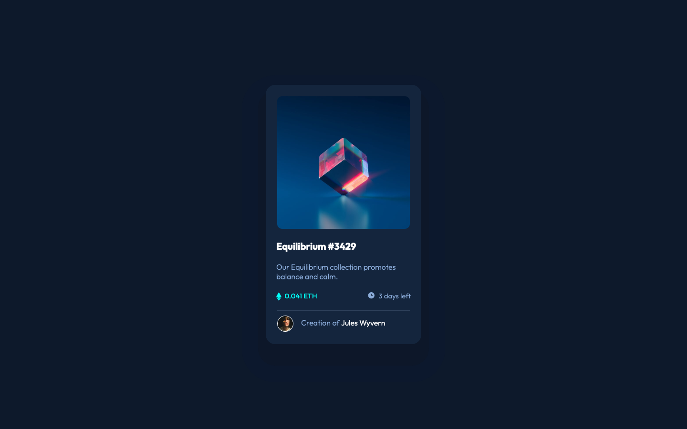
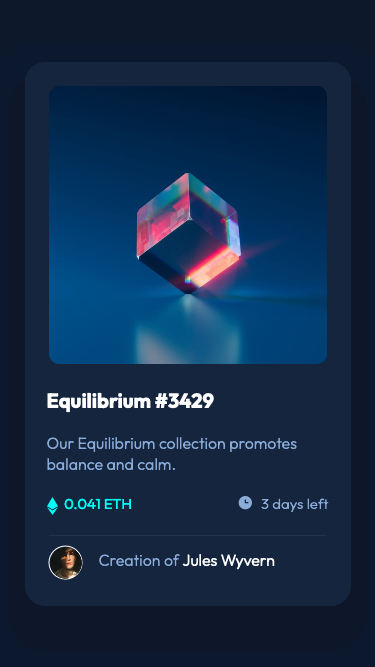

# Frontend Mentor - NFT preview card component solution

This is a solution to the [NFT preview card component challenge on Frontend Mentor](https://www.frontendmentor.io/challenges/nft-preview-card-component-SbdUL_w0U). Frontend Mentor challenges help you improve your coding skills by building realistic projects.

## Table of contents

- [Overview](#overview)
  - [The challenge](#the-challenge)
  - [Screenshot](#screenshot)
  - [Links](#links)
- [My process](#my-process)
  - [Built with](#built-with)
  - [What I learned](#what-i-learned)
  - [Continued development](#continued-development)
- [Author](#author)

## Overview

### The challenge

Users should be able to:

- View the optimal layout depending on their device's screen size
- See hover states for interactive elements

### Screenshot




### Links

- Live Site URL: [See the example from my site](https://michaelho02.github.io/Frontend_Mentor-NFT_preview_card_component/)

## My process

### Built with

- Semantic HTML5 markup
- CSS custom properties
- Flexbox

### What I learned

Use this section to recap over some of your major learnings while working through this project. Writing these out and providing code samples of areas you want to highlight is a great way to reinforce your own knowledge.

Through this project, I learn how to style an icon on the same line with the message such as the price and the time via the `vertical-align`:

```html
<div class="card__info">
  <p class="card__price">
    &nbsp; 0.041 ETH
  </p>
  <p class="card__time">
    &nbsp; 3 days left
  </p>
</div>
```

```css
.card__price {
  color: var(--primary-cyan);
  font-size: 1.5rem;
  font-weight: 300;
}

.ethereum {
  vertical-align: middle;
}

.card__time {
  color: var(--primary-blue);
  font-size: 1.5rem;
  font-weight: 300;
}

.clock {
  vertical-align: -10%;
}
```

Additionally, I learn to center the `icon-view` at the center of an image. By using the `possition: absolute` and calculate the `top` and `left` with repsect to the parent of the `icon-view` which is `div.card__top`. I set the position of the `div` to `relative` in which the `icon-view` willl base on the width and height of the `div` to center the icon.

```html
<div class="card__top">
  
  
</div>
```

```css
.card__top {
  position: relative;
  width: 326px;
  height: 326px;
}

.card__view-img {
  position: absolute;
  --padding: calc((278px - 48px) / 2);
  padding: var(--padding);
  --middle: calc(278px / 2);
  top: calc(50% - var(--middle));
  left: calc(50% - var(--middle));
  background-color: hsl(178, 100%, 50%, 50%);
  border-radius: 10px;
  opacity: 0;
}
```

I also apply the flexbox to help me align the two text `price` and `time` on the same line.

```html
<div class="card__info">
  <p class="card__price">
    &nbsp; 0.041 ETH
  </p>
  <p class="card__time">
    &nbsp; 3 days left
  </p>
</div>
```

```css
.card__info {
  display: flex;
  justify-content: space-between;
}
```

### Continued development

Use this section to outline areas that you want to continue focusing on in future projects. These could be concepts you're still not completely comfortable with or techniques you found useful that you want to refine and perfect.

**Note: Delete this note and the content within this section and replace with your own plans for continued development.**

## Author

- Website - [Ho Le Minh Thach (Michael Ho)](https://github.com/MichaelHo02)
- Frontend Mentor - [@MichaelHo02](https://www.frontendmentor.io/profile/MichaelHo02)
